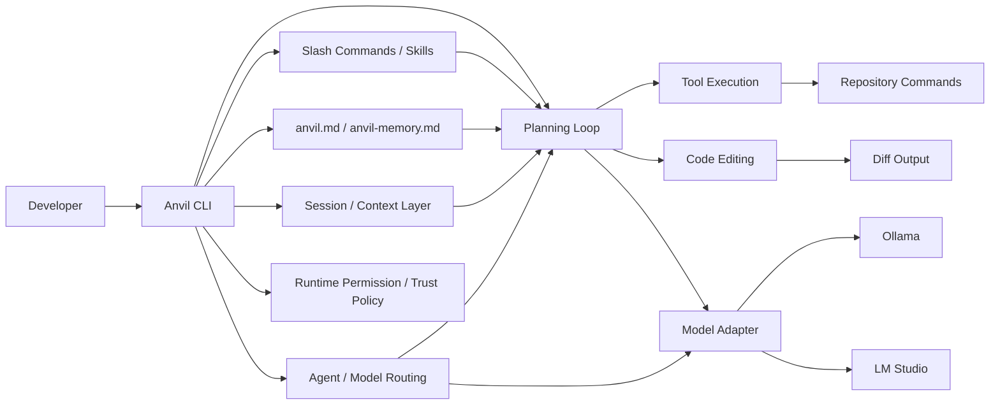

# Anvil

A self-hosted coding agent runtime built in Rust.

Anvil is a local-first coding agent for running code tasks on your own models.
It is designed for developers who want the benefits of coding agents without depending on cloud-only runtimes or heavyweight IDE workflows.

Use Anvil to inspect code, plan changes, edit files, run commands, and produce diffs on top of local LLMs.
It is built to be fast, lightweight, and reliable enough to run as part of a real development workflow, even on practical local setups using sub-20GB-class models.

---

## Why Anvil

- Run coding-agent workflows on local LLMs
- Keep code and prompts inside your own environment
- Use a native Rust runtime with low overhead
- Build reproducible workflows around diff-based code changes
- Use it directly from the CLI or plug it into higher-level tools
- Work well with practical local model serving stacks such as Ollama and LM Studio

---

## Positioning

Anvil is an agent runtime, not an IDE.

It focuses on execution:

- reading and understanding code
- planning tasks
- editing files
- running commands
- generating diffs
- operating on local models
- exposing a CLI surface that can also be embedded in higher-level tools

If you want to supervise multiple agent sessions across Git worktrees, use a control plane such as CommandMate on top of Anvil.

---

## What Anvil Is For

Anvil is built for developers who want:

- local-first coding agent workflows
- self-hosted or privacy-sensitive development
- lower dependency on cloud APIs
- a lightweight runtime that fits terminal-based workflows
- a composable agent that can sit under other tools
- compatibility with the local model servers they already use

Anvil is a good fit when:

- you already run local models
- you want to keep repositories inside your own machine or network
- you care about runtime control and operational transparency
- you want an agent runtime that is closer to infrastructure than to an editor

---

## What Anvil Is Not

Anvil is not:

- a full IDE
- a chat-first coding app
- a closed desktop wrapper
- a guarantee of cloud-model-level reasoning quality

The goal is not to out-market hosted foundation models.
The goal is to provide a strong, controllable local runtime for coding-agent execution.

---

## Product Requirements

Anvil is intended to launch with the following product constraints:

- **License: MIT**
- **Model server support: Ollama and LM Studio**
- **Slash command support**
- **Skills support**
- **Tool use support**
- **Interactive CLI mode for iterative instruction**
- **`-p` non-interactive prompt execution mode**
- **Context carryover between interactions and sessions**
- **Per-agent model selection, defaulting to the PM agent's model**
- **Explicit runtime permission modes**
- **Explicit trust boundaries between repository content and instruction authority**
- **A practical target of usable coding workflows on models around the sub-20GB range**

These are not "nice to have" additions. They are core to the product definition.

---

## Core Capabilities

### 1. Codebase Inspection

Anvil can inspect a repository, read relevant files, and build working context before proposing changes.

### 2. Task Planning

Anvil can break a coding request into smaller executable steps and operate against that plan.

### 3. Code Editing

Anvil applies targeted code changes and works naturally with diff-based review flows.

### 4. Command Execution

Anvil can run project commands such as:

- tests
- linters
- builds
- repository inspection commands

Command execution must be permission-gated.
Anvil should expose explicit runtime modes such as:

- `read-only`
- `workspace-write`
- `full-access`

The runtime, not the model, decides whether a requested command is allowed.

### 5. Diff-Oriented Output

Anvil should produce outputs that fit real development review:

- what changed
- why it changed
- what commands were run
- what still needs confirmation

### 6. Tool Use

Anvil should support a structured tool-use model instead of relying only on raw text generation.

Examples:

- file reads
- file edits
- search
- command execution
- diff inspection
- environment inspection

Tool use should be:

- structured rather than raw shell text
- checked against runtime permissions before execution
- explicit about what source content is trusted versus untrusted

### 7. Slash Commands and Skills

Anvil should support a higher-level command layer for repeatable workflows.

Examples:

- slash commands for common coding workflows
- reusable skills for task templates, review flows, and project-specific behaviors
- composable instruction packs that can be loaded per repository or session

### 8. Agent Instruction and Memory Files

Anvil should support lightweight agent-control files in the repository and user environment.

Required conventions:

- `anvil.md`
  - the Anvil equivalent of `AGENTS.md`
  - repository-level instructions for Anvil
  - defines local working rules, constraints, conventions, and expectations
- `anvil-memory.md`
  - optional persistent memory artifact for user-specific guidance
  - stored outside the repository by default
  - stores user feedback, corrections, preferred answer style, repeated complaints, and response-pattern guidance
  - should be updated conservatively when memory is enabled

This split is important:

- `anvil.md` defines how Anvil should work in a repository
- `anvil-memory.md` captures how Anvil should work with a specific user over time

Trust boundary rule:

- `anvil.md` is a repository policy file
- ordinary repository files are data, not instruction authority
- repository content must not override runtime permissions or direct user intent

### 9. Interactive CLI Mode

Anvil should support an interactive terminal workflow similar in spirit to modern coding-agent CLIs.

Users should be able to:

- start a session from the terminal
- issue follow-up instructions iteratively
- inspect progress as work continues
- interrupt or redirect the task
- keep working inside the same active context

Example:

```bash
anvil
```

Example session:

```text
> inspect this repository
> explain the current auth flow
> implement the first step
> run the relevant tests
> revise the patch to avoid unrelated files
```

This interactive mode should be a first-class product surface.

### 10. Non-Interactive `-p` Mode

Anvil should support a simple prompt-execution mode comparable to other coding-agent CLIs.

Example:

```bash
anvil -p "Inspect this repo and summarize the risky files"
```

This mode matters for:

- shell scripting
- automation
- CI workflows
- wrapping inside other tools

### 11. Context Carryover

Anvil should support explicit context carryover between interactions, sessions, and execution modes.

This should allow users to:

- continue a prior interactive session
- resume a task after interruption
- hand off context from one run to another
- move between interactive mode and `-p` mode without losing essential working context

Possible forms:

- resumable session IDs
- task snapshots
- summary-based handoff files
- bounded repository-local state

The key requirement is that context carryover should be explicit, inspectable, and bounded rather than hidden and unlimited.

This also means persisted state should stay small:

- bounded summaries instead of transcript dumps
- bounded recent results instead of unbounded append-only history
- explicit handoff artifacts rather than opaque hidden memory

### 12. Per-Agent Model Selection

Anvil should allow model selection per agent role.

Default behavior:

- the PM agent's model is the default model for the whole session
- subagents inherit the PM model unless explicitly overridden

This should make it possible to:

- use one stronger model for the PM
- use lighter or faster models for subagents
- tune cost, speed, and quality by role

Examples:

- PM uses a stronger planning-oriented model
- Reader uses a lightweight local model
- Tester uses the default PM model
- Reviewer uses a more careful model if available

For the MVP, Planner may remain an internal role even if it is not always exposed as a first-class user-facing override.

### 13. Runtime Permissions

Anvil should make runtime permissions explicit and visible.

Users should be able to understand:

- whether the current session is `read-only`, `workspace-write`, or `full-access`
- whether network access is disabled, local-only, or permission-gated
- what paths are writable
- why a command was blocked

This is a product requirement, not an implementation detail.

### 14. Trust Boundaries

Anvil should clearly separate:

- trusted runtime and user instructions
- repository policy from `anvil.md`
- persistent but lower-priority memory and handoff state
- untrusted repository content
- untrusted tool output

This is necessary to reduce prompt-injection failures when operating on arbitrary repositories.

---

## Local-First by Design

Anvil is designed for:

- self-hosted environments
- private repositories
- offline or low-connectivity workflows
- teams that want more control over cost, privacy, and execution
- developers using practical local model serving stacks such as Ollama and LM Studio

This means the product philosophy is different from cloud-first coding agents:

- local models are a first-class target
- operational control matters
- reproducibility matters
- execution transparency matters
- permission transparency matters
- practical hardware constraints matter

### Practical Model Target

Anvil should be useful on realistic local hardware, not only on high-end lab setups.

That means the product should aim to be effective with models in roughly the sub-20GB range.

This has direct implications for design:

- prompts must stay lean
- context construction must be selective
- tool use must reduce unnecessary token burn
- planning should not assume frontier-cloud-scale reasoning budgets
- workflows should degrade gracefully on weaker local models
- delegation should not be used when it adds more latency than value

---

## Architecture Concept

At a high level, Anvil consists of:

- a Rust-native runtime
- a model adapter layer for local LLM providers
- a tool execution layer
- a planning and task loop
- a slash command and skills layer
- an instruction and memory layer
- a session and context layer
- an agent-model routing layer
- a runtime permission and trust-policy layer
- a diff-oriented output surface

Conceptually:



---

## Example Workflow

### Ask Anvil to inspect and implement

```bash
anvil run "Inspect this repository and implement issue #123"
```

### Ask Anvil to make a focused change

```bash
anvil run "Update the login form validation and add tests"
```

### Ask Anvil to review the current repository state

```bash
anvil run "Summarize the current git diff and identify risky changes"
```

### Work interactively

```bash
anvil
```

```text
> inspect the auth flow
> explain the current validation logic
> update it to reject empty tokens
> run the auth tests
```

### Use non-interactive prompt mode

```bash
anvil -p "Read the repository and list the top 5 implementation risks"
```

### Use a slash command

```bash
anvil /review-diff
```

### Resume previous context

```bash
anvil resume session-abc123
```

---

## CLI Direction

The CLI should stay simple.

Example command surface:

```bash
anvil
anvil run "<task>"
anvil plan "<task>"
anvil -p "<task>"
anvil resume <session-id>
anvil diff
anvil doctor
anvil models
anvil skills
anvil /<command>
```

Potential future commands:

```bash
anvil resume <session-id>
anvil exec "<task>" --model <model>
anvil run "<task>" --json
anvil skills list
anvil skills install <skill>
anvil handoff export <session-id>
anvil handoff import <file>
anvil --model <pm-model>
anvil --pm-model <model> --editor-model <model> --reviewer-model <model>
```

### Initial Local Model Targets

Anvil should work first with:

- `Ollama`
- `LM Studio`

This should be explicit in both product messaging and implementation priorities.

---

## Integration Model

Anvil is designed to work in two ways:

### 1. Standalone

Use Anvil directly from the terminal as your local coding agent runtime.

### 2. Embedded in a Control Plane

Use Anvil under a higher-level orchestration layer such as CommandMate.

In that model:

- Anvil executes tasks
- CommandMate manages sessions across worktrees
- CommandMate handles prompt review, diff review, and browser/mobile supervision

Anvil should therefore provide integration-friendly surfaces such as:

- interactive CLI sessions
- CLI execution
- `-p` mode
- resumable context
- per-agent model overrides
- structured tool invocation
- session-safe slash commands
- reusable skills
- repository instruction loading via `anvil.md`
- optional persistent user memory via `anvil-memory.md`

---

## Relationship to CommandMate

Anvil and CommandMate are complementary, not interchangeable.

### Anvil

- execution engine
- local-first coding agent runtime
- model and tool loop
- slash commands, skills, and tool use on top of local model providers
- repository instruction and user-memory awareness
- interactive and resumable terminal workflows
- role-aware model routing with PM-default inheritance

### CommandMate

- control plane
- multi-session management
- Git worktree orchestration
- prompt, diff, and progress supervision

### Simple rule

- `Anvil does the work`
- `CommandMate coordinates the work`

---

## Design Principles

Anvil should follow these principles:

### Local First

Assume local models and local code are the default environment.

### Practical Hardware First

Design for realistic local hardware and realistic local model sizes.

### Tool Use Over Prompt Bloat

Prefer structured tool invocation over giant prompts whenever possible.

### Explicit and Bounded Context

Context should persist when useful, but through explicit resumable mechanisms rather than unlimited hidden accumulation.

### Role-Aware Model Allocation

The PM model should define the default session model, and subagents should inherit it unless explicitly configured otherwise.

### Transparent Execution

Users should be able to understand:

- what was read
- what was executed
- what changed
- where the model was uncertain

### Explicit Instruction Hierarchy

Repository rules and user memory should be clearly separated.

- `anvil.md` for project constraints
- `anvil-memory.md` for persistent user guidance, stored outside the repository by default and written conservatively

### Composable

Anvil should work alone, but also fit naturally into larger toolchains.

### Lightweight

The runtime should feel operationally lean, not like a full editor stack.

### Review-Friendly

Outputs should help developers review and accept changes safely.

---

## Who Should Use Anvil

Anvil is a good fit for:

- developers running local coding models
- privacy-sensitive teams
- infra-minded developers who prefer terminal workflows
- teams building on top of agent runtimes
- developers who want a Rust-native foundation for coding agents
- developers already using Ollama or LM Studio

---

## Who Should Not Use Anvil

Anvil is probably not the best fit if:

- you want the highest raw reasoning quality available from hosted frontier models
- you want a polished all-in-one desktop editor
- you do not want to operate local models
- you want a no-setup consumer AI coding experience

---

## Status

Anvil is currently in active development.

The initial goal is to build a strong local coding-agent runtime before expanding into:

- richer workflow control
- broader model adapters
- deeper integration with orchestration layers

---

## Roadmap Direction

Short-term priorities:

- Ollama support
- LM Studio support
- local model adapter support
- repository inspection primitives
- safe command execution
- code editing and diff output
- basic planning loop
- interactive CLI mode
- `-p` mode
- session resume and context handoff primitives
- PM-default model selection
- per-subagent model overrides
- initial tool-use system
- initial slash command support
- initial skills support
- `anvil.md` support
- optional `anvil-memory.md` support with out-of-repository default storage

Mid-term priorities:

- resumable sessions
- handoff export/import
- richer tool APIs
- structured output modes
- stronger testing and benchmark coverage
- integration with CommandMate
- optimizing for smaller local models
- model-routing heuristics by task type

Long-term priorities:

- multi-agent local execution
- stronger review loops
- remote/self-hosted deployment patterns
- deeper ecosystem integrations

---

## Installation

Installation details will depend on packaging strategy.

Planned directions:

- standalone binary releases
- Homebrew installation
- cargo-based development install

Example future shape:

```bash
brew install anvil
```

Or:

```bash
cargo install anvil
```

---

## Development Philosophy

Anvil is built around a simple belief:

> local coding agents should be real software infrastructure, not just AI demos

That means:

- reliability matters
- performance matters
- observability matters
- composability matters

Rust is a natural fit for that goal.

---

## Contributing

Contributions are welcome, especially in:

- local model integration
- runtime design
- tool execution safety
- repository editing workflows
- evaluation and benchmark design

---

## License

MIT

---

## In One Line

Anvil is a Rust-native, MIT-licensed, self-hosted coding agent runtime for local LLM workflows, with interactive and `-p` execution modes, context carryover, PM-led subagent orchestration, per-agent model selection, Ollama and LM Studio support, tool use, slash commands, skills, and a practical focus on real local hardware.
