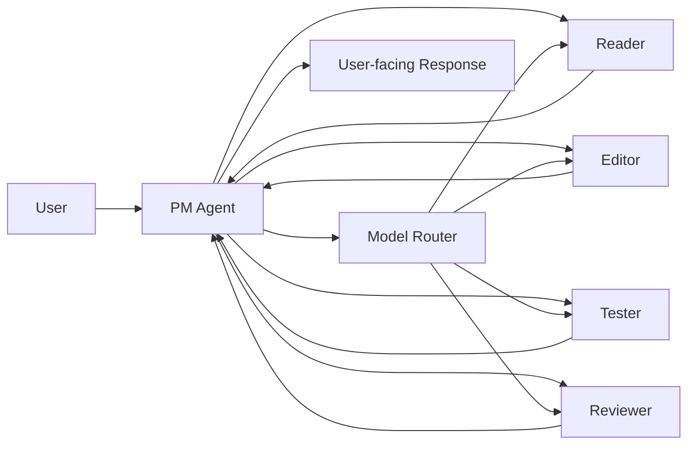

# Anvil PM + Subagent Architecture

## Summary

For Anvil's interactive mode, the recommended architecture is not a single ever-growing conversation context.

Instead, Anvil should use:

- a `PM agent` as the user-facing interaction layer
- a set of `subagents` for bounded execution tasks

This architecture is especially important if Anvil aims to remain practical on local models in the sub-20GB range.

The goal is to prevent quality collapse caused by:

- bloated context windows
- irrelevant conversation history
- repeated reprocessing of the same state
- weak small-model performance under long interactive sessions

---

## Core Idea

The user talks to one CLI.
Internally, that CLI is backed by a planner/coordinator layer.

### User-facing model

From the user's perspective:

- they are talking to `Anvil`
- the session feels continuous
- follow-up instructions work naturally

### Internal model

Internally:

- the `PM agent` receives all user instructions
- the PM updates session state and working summary
- the PM delegates focused work to specialized subagents
- subagents operate on short, bounded contexts
- the PM merges results and replies to the user
- each agent can use a role-specific model, with the PM model as the default inheritance source

---

## Why This Is Better for Local Models

Small and mid-sized local models usually degrade under long interactive history because:

- too much irrelevant prior dialogue is carried forward
- instruction hierarchy becomes noisy
- token budget gets spent on stale context
- reasoning quality collapses when the prompt becomes too broad

The PM + subagent model reduces this problem by:

- keeping global dialogue at the PM layer only
- sending only the minimum necessary context to each subagent
- compressing state into structured summaries instead of raw transcript history
- using role-specific prompts that are easier for smaller models to follow

---

## Agent Roles

## Model Assignment Rule

Each agent role should support explicit model assignment.

Default rule:

- the PM agent model is the session default
- all subagents inherit the PM model unless a role-specific override is configured

This gives a practical default while still allowing specialization.

Example:

```json
{
  "pm": "qwen-coder-14b",
  "reader": "qwen-coder-7b",
  "editor": "qwen-coder-14b",
  "tester": null,
  "reviewer": "deepseek-coder-14b"
}
```

Here:

- `tester: null` means "inherit PM model"

### Why this matters

- better performance tuning on local hardware
- ability to use stronger reasoning where needed
- ability to use lighter models for retrieval-like tasks
- explicit control instead of hidden heuristics

## 1. PM Agent

### Responsibility

- receive user instructions
- maintain task continuity
- decide what kind of work is needed
- select subagents
- generate scoped instructions
- merge results
- produce final user-facing responses

### PM should own

- session summary
- user intent tracking
- task queue
- active constraints
- unresolved questions
- subagent result registry
- agent-model assignment defaults

### PM should not do directly unless necessary

- large file-by-file editing
- deep repository scanning
- all command execution
- all review logic

The PM should coordinate more than execute.

---

## 2. Reader Subagent

### Responsibility

- inspect repository structure
- read relevant files
- summarize current implementation
- extract facts needed by PM or other subagents

### Typical output

- relevant files
- architecture summary
- key implementation details
- risk areas

---

## 3. Planner Subagent

### Responsibility

- convert objective into a concrete execution plan
- identify dependencies
- propose sequencing
- highlight ambiguity

### Typical output

- task breakdown
- assumptions
- risk list
- recommended next action

Note:

This role can initially be merged into the PM if needed.

---

## 4. Editor Subagent

### Responsibility

- propose or apply focused code changes
- operate only within bounded file scope
- explain intended edits

### Typical output

- files changed
- patch summary
- open concerns
- suggested follow-up validation

---

## 5. Tester Subagent

### Responsibility

- run tests, linters, and builds
- summarize failures
- isolate likely causes

### Typical output

- commands run
- pass/fail summary
- failing scope
- actionable follow-up

---

## 6. Reviewer Subagent

### Responsibility

- inspect diffs
- evaluate correctness risks
- identify regressions
- highlight missing tests

### Typical output

- findings
- severity
- file references
- recommended fixes

---

## Recommended Initial Scope

Do not start with too many subagents.

Initial practical set:

- `PM`
- `Reader`
- `Editor`
- `Tester`
- `Reviewer`

This is enough to build a useful interactive architecture without excessive orchestration overhead.

---

## Session State Model

The PM should maintain structured session state rather than a raw transcript-only model.

Recommended top-level state:

```ts
interface SessionState {
  sessionId: string;
  pmModel: string;
  permissionMode: 'read-only' | 'workspace-write' | 'full-access';
  networkPolicy: 'local-only' | 'disabled' | 'enabled-with-approval';
  agentModels: Record<string, string | null>;
  objective: string;
  workingSummary: string;
  userPreferencesSummary: string;
  repositorySummary: string;
  activeConstraints: string[];
  openQuestions: string[];
  completedSteps: string[];
  pendingSteps: string[];
  relevantFiles: string[];
  recentDelegations: DelegationRecord[];
  recentResults: ResultRecord[];
}
```

This state should be updated continuously by the PM.
For the MVP, persisted `agentModels` should cover only public MVP roles such as `reader`, `editor`, `tester`, and `reviewer`.

---

## Context Carryover Strategy

Interactive mode should not rely on replaying the full transcript each time.

Recommended strategy:

### 1. Full transcript stays as raw history

Keep it for debugging or optional inspection.
Do not inject it fully into every model call.

### 2. PM keeps a rolling `workingSummary`

This is the main continuity object.

It should include:

- current objective
- what was learned
- what changed
- what remains
- current constraints

### 3. Each subagent gets scoped context only

Instead of full history, provide:

- subtask goal
- relevant files
- relevant constraints
- minimal supporting summary
- expected output schema

### 4. Resume mode should reload state, not entire dialogue

When resuming a session:

- load session state
- load working summary
- optionally load a short recent interaction summary
- avoid replaying the full conversation unless explicitly requested

---

## Delegation Flow

Recommended flow:

1. user sends instruction
2. PM interprets intent
3. PM updates session state
4. PM determines whether delegation is needed
5. PM sends scoped instruction to subagent
6. subagent returns structured result
7. PM updates summary and task state
8. PM replies to user

Conceptually:



---

## Prompting Pattern

Each subagent should receive a role-specific prompt with explicit boundaries.

In addition, each subagent invocation should include:

- the resolved model for that role
- whether that model is inherited or explicitly overridden

### General structure

```text
Role:
Task:
Relevant context:
Constraints:
Expected output:
```

### Example: Editor subagent

```text
Role:
You are the editing subagent.
Operate only on the files listed below.

Task:
Update login validation to reject empty tokens.

Relevant context:
- auth.ts currently accepts empty strings
- tests exist in auth.test.ts

Constraints:
- Do not modify unrelated files
- Prefer minimal diffs
- Preserve existing naming patterns

Expected output:
- files changed
- change summary
- risks
- suggested validation commands
```

This style is easier for smaller models to follow than a long unstructured conversation.

---

## Structured Output Contract

Subagents should return structured outputs whenever possible.

Example:

```ts
interface SubagentResult {
  role: 'reader' | 'editor' | 'tester' | 'reviewer';
  model: string;
  summary: string;
  evidence?: Array<{ sourceType: string; value: string }>;
  changedFiles?: string[];
  commandsRun?: string[];
  findings?: Finding[];
  nextRecommendation?: string;
}
```

Why:

- easier PM integration
- easier context carryover
- less accidental prompt bloat
- better future compatibility with tool use and JSON mode

---

## Performance Advantages

This architecture improves performance in several ways.

### 1. Less context bloat

Subagents only receive relevant task context.

### 2. More reliable small-model behavior

Smaller models perform better with focused role prompts than with huge general-purpose transcripts.

### 3. Better token efficiency

The PM can summarize once and delegate many times.

### 4. Easier context pruning

Old details can be compressed into summaries without losing entire-session continuity.

### 5. Better future parallelization

Some subagent work can later be parallelized when hardware allows it.

### 6. Better model fit by task

Reader-like tasks can use smaller models, while PM or reviewer tasks can use stronger ones when available.

---

## Tradeoffs

This architecture is not free.

### Costs

- more orchestration logic
- more state management
- more prompt design work
- more failure modes in delegation

### Risks

- weak PM causes weak overall results
- poorly designed result schemas create merge confusion
- too many subagents can increase latency on local hardware

---

## Recommendation on Parallelism

Do not assume full multi-agent parallel execution from day one.

For local hardware, a safer starting point is:

- one PM
- one active subagent at a time
- optional limited parallelism only for lightweight tasks
- PM-default model inheritance, with only a small number of explicit overrides

This keeps memory pressure and latency under control.

---

## Resume and Handoff Design

To support context carryover cleanly, Anvil should support:

### Resume

```bash
anvil resume <session-id>
```

This reloads:

- working summary
- active constraints
- pending steps
- recent subagent results
- permission mode
- network policy

### Handoff

```bash
anvil handoff export <session-id>
anvil handoff import <file>
```

A handoff file should contain:

- objective
- current summary
- pending work
- relevant files
- recent findings

This makes context portable without needing the full transcript.

---

## Recommended Implementation Sequence

### Phase 1

- implement PM agent
- implement Reader and Editor
- add rolling working summary
- add PM-default model selection and inheritance

### Phase 2

- add Tester and Reviewer
- add structured result contracts
- add `resume`
- add explicit per-subagent model override support

### Phase 3

- add handoff export/import
- improve task state model
- refine summarization and pruning

### Phase 4

- evaluate selective parallelism
- optimize for smaller local models
- add adaptive delegation strategies by model capability
- add task-to-model routing heuristics

---

## Final Recommendation

For Anvil's interactive mode, use:

> `PM-led orchestration with bounded subagent execution`

This is the right architecture if Anvil wants:

- interactive CLI usability
- good context carryover
- acceptable performance on practical local models
- explicit role-based model tuning
- a clean path to future extensibility

The user should feel like they are speaking to one intelligent CLI.
Internally, Anvil should behave like a carefully coordinated runtime.
