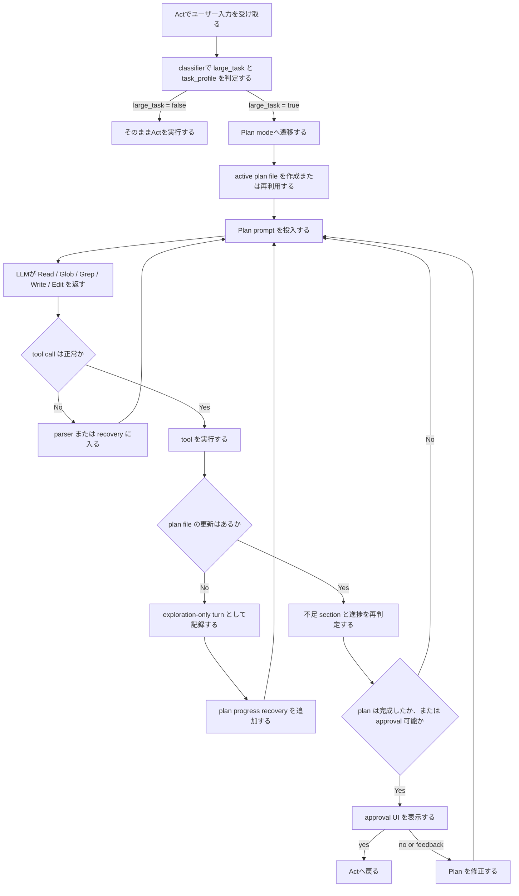

# Planモードのフローチャートと問題点マッピング

## 目的

この文書は、`auto-plan` 有効時の `Plan` モードを対象に、現在の標準フローを可視化し、どこで何が詰まっているかを段階ごとに整理するためのメモです。

主眼は次の2点です。

- `Plan` モードの実行経路を一目で追えるようにする
- ボトルネックをフロー上にマッピングし、改善対象を特定しやすくする

---

## フローチャート



---

## 問題点マッピング

### 1. `A -> B` : classifier

#### 役割

- 入力が大タスクかどうかを判定する
- `task_profile` を `generic / coding / content / ui / research` などへ振り分ける

#### 発生している事象

- transport failure
- parse failure
- fallback依存
- モデルごとに `task_profile` の安定性に差がある

#### 問題点

- 本来 `Plan` に入るべき入力が `Act` に流れることがある
- `content` や `ui` に落ちるべき入力が `generic` に寄ると、後続の prompt と評価観点が弱くなる

#### 現時点の整理

- classifier fallback 自体は以前より改善済み
- ただし完全安定ではなく、`Plan` の入口品質を左右するポイントとして残っている

---

### 2. `C -> E` : Plan mode初期化とprompt投入

#### 役割

- active plan file を作る
- `Plan` 用の指示をまとめてモデルに渡す

#### 発生している事象

- `Plan` 用テンプレートは整理されている
- ただし中規模ローカルLLMにはやや重い
- `Goal / Constraints / Deliverables / Acceptance Criteria / Quality Bar / Execution Plan / Verification Plan / Risks/Fallbacks` の全体像を最初から背負わせている

#### 問題点

- 構造は良くなったが、完走コストが高い
- モデルが「まず plan file を埋める」より「もう少し探索する」を選びやすい

#### 現時点の整理

- 設計思想は改善済み
- ただし runtime での前進制御が弱く、prompt に依存している

---

### 3. `E -> F` : 探索とplan更新の分岐

#### 役割

- モデルが `Read / Glob / Grep / Write / Edit(plan)` のどれを返すか決める

#### 発生している事象

- `Read README.md`
- `Glob *`
- `Glob **/*`
- 同じ探索の反復

#### 問題点

- ここが最大のボトルネック
- `Plan` の本来の目的は plan file の更新だが、探索だけを続けるケースが多い
- note ベースの recovery はあるが、探索ループを止め切れていない

#### 現時点の整理

- `PlanProgress` expectation は入っている
- しかし実質的には「進捗を促す」止まりで、「進捗を強制する」までは至っていない

---

### 4. `F -> G` : tool call品質

#### 役割

- LLM出力が有効な tool call として解釈できるか判定する

#### 発生している事象

- malformed XML/JSON
- nested arguments
- `file` と `path` の揺れ
- `body/text/content` の揺れ

#### 問題点

- モデルが plan を考えていても、tool call の形が崩れると実行できない
- `Write(plan)` に進みかけても、引数不正で失敗することがある

#### 現時点の整理

- `Write/Edit` の引数補正は一部採用済み
- ここは改善実績があるが、完全には吸収し切れていない

---

### 5. `I -> J` : tool実行後の進捗判定

#### 役割

- そのターンで plan file が更新されたかを判定する
- 更新されていなければ exploration-only turn として扱う

#### 発生している事象

- `Read` は成功するが plan file は変わらない
- recovery note を積んでも次ターンで再度 `Read` に戻る

#### 問題点

- 現在の recovery は「行動変容をお願いする」寄りで、強制力が弱い
- 探索中心の turn を検出しても、その次の turn を十分に拘束できない

#### 現時点の整理

- ここが `Plan` 実行制御の弱点
- `Plan` の問題は構造不足ではなく、前進制御不足である

---

### 6. `K -> N` : 完成判定

#### 役割

- 必須セクションが十分に埋まったかを見る
- approval UI に進めるかを判断する

#### 発生している事象

- `Quality Bar` まで含めた厳しめの基準になっている
- 中規模モデルでは、そこへ届く前に探索停滞や malformed tool call に落ちやすい

#### 問題点

- 品質基準を上げたことで、approval 到達前に止まりやすくなった
- 完成条件が間違っているわけではないが、今の前進制御の弱さと組み合わさると重い

#### 現時点の整理

- approval 条件の厳しさ自体より、その前段で止まることの方が大きい
- ここを直接緩めても、根本改善にならないケースが多かった

---

### 7. `N -> O` : approval UI

#### 役割

- `yes / no / feedback` を受けて `Act` へ進むか `Plan` を修正するか決める

#### 発生している事象

- UI 自体は動作する
- ただし多くのモデルがそこまで届かない

#### 問題点

- approval UX 自体が本丸ではない
- ここを改善しても、到達率が低い限り全体改善にはなりにくい

#### 現時点の整理

- `approval` は問題の中心ではない
- 中心はその手前の `Plan` 完成前進制御

---

## ボトルネックの中心

現在の `Plan` モードで最も問題なのは、次の区間です。

```text
E -> F -> I -> J
```

つまり、

- prompt を受けたモデルが
- 探索系 tool call を返し
- 実行後も
- plan file 更新へ安定して進めない

という流れです。

短く言うと、現在の `Plan` モードは

- 入口の classifier
- tool call の堅牢性

にも課題はあるが、主問題は

**探索から plan file 更新へ前進させる runtime 制御の弱さ**

にあります。

---

## まとめ

現在の `Plan` モードは、テンプレート、section 構造、approval UI までは整っています。  
一方で、運用上のボトルネックは次に集中しています。

- classifier が完全には安定していない
- 中規模モデルが `Read/Glob` に寄りやすい
- recovery が note ベースで強制力に欠ける
- 完成判定が重く、approval 前に止まりやすい

したがって、次に優先すべき改善は、prompt の追加ではなく、

- 探索反復の検出
- plan file 更新への強制前進
- tool call 吸収の強化

といった **Plan の runtime guard 強化** です。
